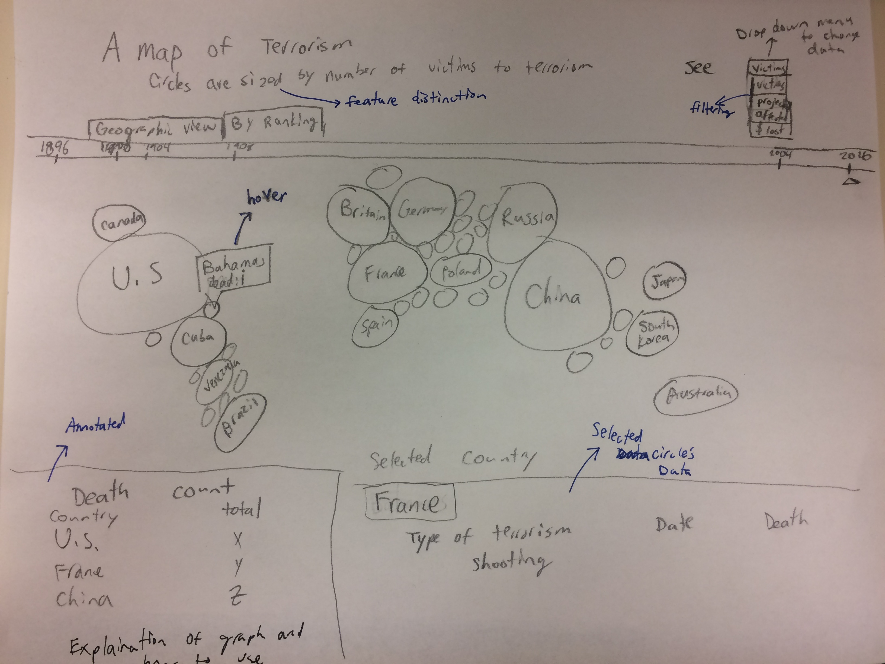

# Map

## Visual Narrative
**Consistent Visual Platform**
>My graph uses a consistent visual platform because all of the filtering and user interactions just change the graph in the middle - everything else stays the same. This helps to clearly communicate what actually changes to the user.

**Feature Distinction**
> Since every country is designated with a circle, the radius of each circle determines the magnitude of the variable we are measuring. This allows us to compare between different countries.

**Familiar Objects**
> Whenever there is a transition, the only thing that changes is the size (or ordering) of the circles. However, the object of interest remains as a circle.

## Narrative Structure
**User Directed Path**
> As with any map, the user will usually have completely control over what they explor first and how they explore is. This is because all the information is presented to the user, and what they explore is completely at their discretion.

**Hover Highlighting**
> Whenever you hover over a country circle, more information comes out. With this, the user is able to explore more information about a country than otherwise would be possible.

**Filtering**
> The user can filter the data based on several factors, and also by year. This increases the user's interpretation since they are now able to this allows the user to selectively view the information.

**Captions**
> These show the overall topic that everything falls under. Without the caption and title, the user wouldn't have any idea how to interpret and process the graph (without context, everything is useless).

**Annotation**
>The botton left of this graph is annotated (constant) infromation that shows the death counts for the top countries, and provides more information on the graph itself.